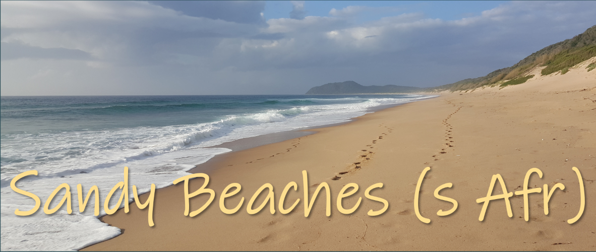
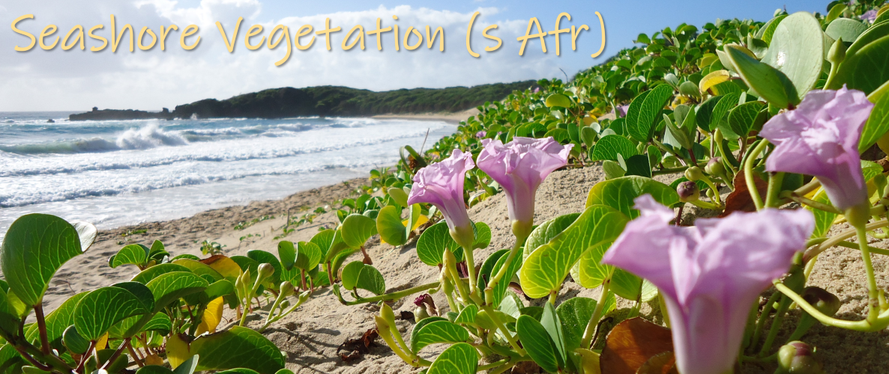
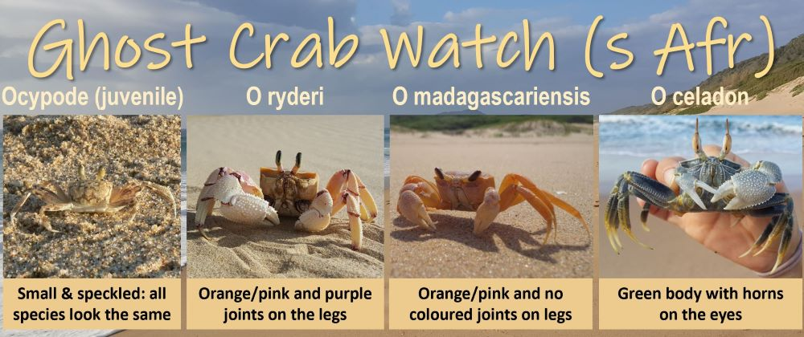

[{style="float: right; margin-left: 15px" width="203"}](https://www.inaturalist.org/) If you have ever wanted to contribute to research and conservation, this is your chance! There are several citizen science projects on iNaturalist that you can join. It's the perfect excuse to go to the beach!

Think of it as Instagram for nature. Go to the beach, take pictures of any plants or animals that you can find with the GPS of your phone turned on, post the pictures to the iNaturalist app (on the Apple and Play Stores) or the [iNaturalist](https://www.inaturalist.org/) website, use the AI suggestions for the identification or give it your best guess, and you're done. Other people will help to identify what you saw, and when enough people agree, the observation gets recorded as 'Research Grade'.

You never know, you might just have found a species that no one knows about yet. Or found a species where it hasn't previously been recorded. All observations count!

There are three beach projects you can contribute to...

### 1. Sandy Beaches (s Afr)

::: {style="display: block; clear: both;"}
{style="float: left; margin-right: 15px; margin-leftt: 1px" width="320"}

This project includes all observations of sandy beach macrofauna - the insects, crabs, snails, clams, sand piranhas, worms and other small invertebrate animals on beaches in southern Africa. Most of these species have very limited distributions and are often found in one bioregion, and no where else in the world! The best places to look for these animals is where the sand is wet on the beach, and under washed-up kelp, seaweed and damp driftwood.
:::

::: {#sandybeachessafr .inat-widget style="display: block; clear: both;"}
```{=html}
<script
  type="text/javascript"
  charset="utf-8"
  src="https://www.inaturalist.org/observations/project/60298.widget?layout=small&limit=12&order=desc&order_by=submitted_on">
</script>
```

```{=html}
<div class="inat-footer">
    Latest observations. Explore all observations at
    <strong><a href="https://www.inaturalist.org/projects/sandy-beaches-s-afr" target="_blank">
      Sandy Beaches (s Afr) »
    </a>
  </strong>
</div>
```
:::

### 2. Seashore Vegetation (s Afr)

::: {style="display: block; clear: both;"}
{style="float: left; margin-right: 15px; margin-leftt: 2px" width="320"} Dunes are the most sensitive component of sandy shores. The plants that grow on dunes are highly specialised, with pioneer species helping to bind sand together and promote dune formation. Dune plants sometimes require a salt crust on the surface of the sand so they can establish themselves and grow. The salt crust breaks when people walk on dunes, so if you're taking pictures of dune plants, try to keep off the dune itself to protect these important plants.
:::

::: {#seashorevegetation .inat-widget style="display: block; clear: both;"}
```{=html}
<script
  type="text/javascript"
  charset="utf-8"
  src="https://www.inaturalist.org/observations/project/60970.widget?layout=small&limit=12&order=desc&order_by=submitted_on">
</script>
```

```{=html}
<div class="inat-footer">
    Latest observations. Explore all observations at
    <strong><a href="https://www.inaturalist.org/projects/seashore-vegetation-s-afr" target="_blank">
      Seashore Vegetation (s Afr) »
    </a>
  </strong>
</div>
```
:::

### 3. Ghost Crab Watch (s Afr)

::: {style="display: block; clear: both;"}
{style="float: left; margin-right: 15px; margin-leftt: 3px" width="320"}

With climate change, many species are shifting their ranges to move into climatic conditions that have become suitable for them, or move away from areas that are no longer suitable. Beach animals only have one choice - to move along the shore, so it's reasonably easy to track shifts in their ranges. Ghost crabs are expanding their ranges along the South African south coast as the Agulhas Current warms, and the baby crabs are able to survive the cold winters.
:::

::: {#ghostcrabwatch .inat-widget style="display: block; clear: both;"}
```{=html}
<script
  type="text/javascript"
  charset="utf-8"
  src="https://www.inaturalist.org/observations/project/60397.widget?layout=small&limit=12&order=desc&order_by=submitted_on">
</script>
```

```{=html}
<div class="inat-footer">
    Latest observations. Explore all observations at
    <strong><a href="https://www.inaturalist.org/projects/ghost-crab-watch-s-afr" target="_blank">
      Ghost Crab Watch (s Afr) »
    </a>
  </strong>
</div>
```
:::
