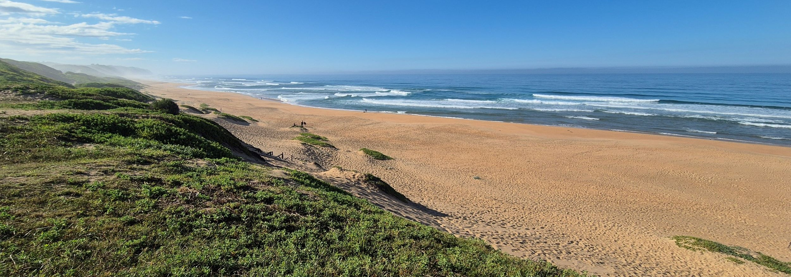
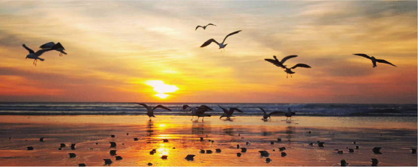
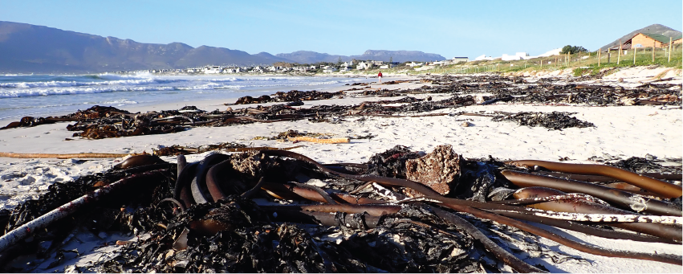
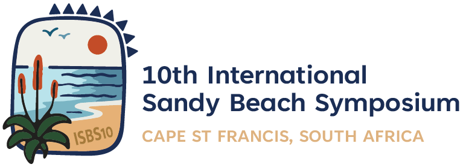
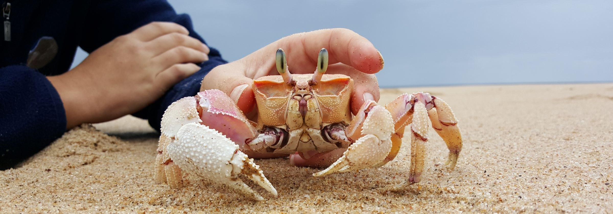

Welcome to the home of sandy beach science in South Africa. Here, you will be able to [**learn about beaches**](aboutbeaches/learn_home.qmd). You can explore the different types of sandy shores, and find out more about the animals that call beaches home, the pressures beaches are facing, the best management and conservation actions, and how you can contribute and make a difference.

This website is continually updated with information - bookmark it or follow us on [Instagram](https://www.instagram.com/sandybeachscience/){target="_blank"} to find out when new content is added.

## Research projects

There are several international projects that are underway. Choose one below to read more about the research we are doing.

::::::::: grid
::::: {.g-col-12 .g-col-md-6 .g-col-lg-4}
:::: card
[{style="margin-bottom: 0;"}](beachesforlife/bfl_home.qmd)

::: {style="padding: 5px;"}
### Beaches for Life! {.mt-0 .mb-1}

Catalyzing sandy beach conservation in south/east Africa through data, indicators, focus areas for conservation, and a new community of beach scientists

[Read more](beachesforlife/bfl_home.qmd)
:::
::::
:::::

::::: {.g-col-12 .g-col-md-6 .g-col-lg-4}
:::: card
[{style="margin-bottom: 0;"}](tidelines/tidelines_home.qmd)

::: {style="padding: 5px;"}
### TIDELINES {.mt-0 .mb-1}

Transformative change and Innovations for Diverse beach Ecosystems and sustainable Livelihoods through Enhanced wrack maNagEment Strategies

[Read more](tidelines/tidelines_home.qmd)
:::
::::
:::::
:::::::::

## Upcoming events

:::::: grid
::::: {.g-col-12 .g-col-md-6 .g-col-lg-4}
:::: card
[{style="margin-bottom: 0;"}](https://www.beachsymposium.org)

::: {style="padding-left: 15px; margin-top: 5px;"}
### ISBS10 {.mt-0 .mb-1}

The 10th International Sandy Beach Symposium is coming to South Africa, 21-27 June 2027!

[Read more](https://www.beachsymposium.org){target="_blank"}
:::
::::
:::::
::::::

## Citizen science

Would you like to contribute to beach conservation and research? Find out how [what you can do](citizenscience.qmd).

