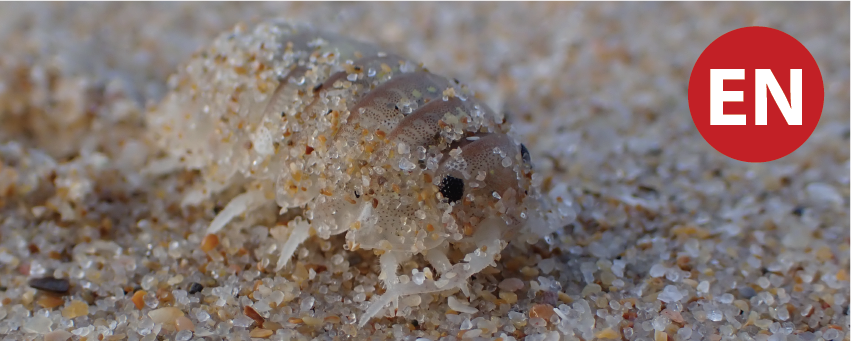
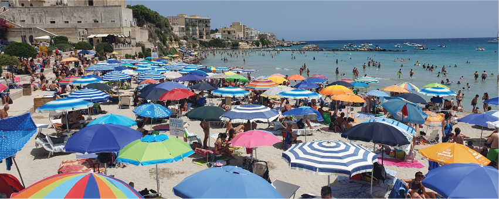
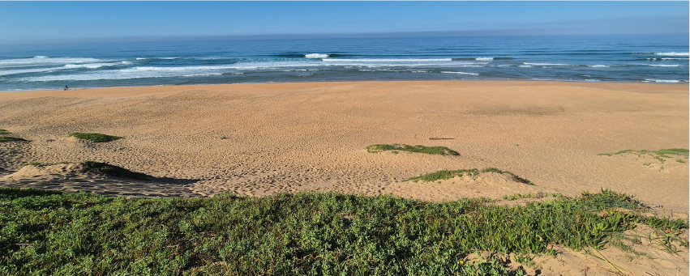

## Featured papers

:::::::::::: grid
::::: {.g-col-12 .g-col-md-6 .g-col-lg-4}
:::: card
{style="margin-bottom: 0;"}

::: {style="padding: 5px;"}
### Threat status assessments {.mt-0 .mb-1}

The first red list assessments of sandy beach ecosystem types and invertebrate species, globally. In South Africa, 3 of 12 beach ecosystem types are Endangered, and 4 of 20 species assessed are Endangered. Key pressures are mining, coastal development, artificial light at night, and wrack removal.

[Read more](https://doi.org/10.1016/j.ecss.2025.109447){target="_blank"}
:::
::::
:::::

::::: {.g-col-12 .g-col-md-6 .g-col-lg-4}
:::: card
{style="margin-bottom: 0;"}

::: {style="padding: 5px;"}
### Beach ecosystem services {.mt-0 .mb-1}

Beaches provide important benefits to people, delivering two-thirds of all types of recognised ecosystem services, including every type of cultural service. All components of the littoral active zone (dunes, beach, surf) are important for delivering services in 11 ecosystem service bundles.

[Read more](https://doi.org/10.1016/j.ecoser.2022.101477){target="_blank"}
:::
::::
:::::

::::: {.g-col-12 .g-col-md-6 .g-col-lg-4}
:::: card
{style="margin-bottom: 0;"}

::: {style="padding: 5px;"}
### Mapping beach ecosystems {.mt-0 .mb-1}

As ecotonal ecosystems at the land-sea interface, beaches are often poorly represented in ecosystem maps. We define a seashore zone from the dune base - as a proxy for the decadal scale high water mark - to the back of the surf zone, using remote methods to map ecosystem types therein.

[Read more](https://doi.org/10.1016/j.biocon.2019.06.020){target="_blank"}
:::
::::
:::::
::::::::::::

## Searchable publication list

Search for my publications related to beaches, and beaches as part of coastal systems. For a full list of publications, including those related more to the offshore marine environment, and to systematic conservation planning, view my [ORCID profile](https://orcid.org/0000-0003-4719-0481).

```{r echo=FALSE, warning=FALSE, message=FALSE}
library(RefManageR)
library(dplyr)
library(purrr)
library(reactable)

refs <- ReadBib("references.bib")

pubs <- refs |>
  purrr::map(\(ref) {
    
    authors <- vapply(ref$author, \(a) {
      
      family <- paste(a$family, collapse = " ")
      given <- paste0(substr(a$given, 1, 1), ".", collapse = "")
      
      paste0(family, ", ", given)
      
    }, FUN.VALUE = character(1))
    
    tibble::tibble(
      author  = paste(authors, collapse = ", "),
      year    = as.integer(ref$year),
      title   = as.character(ref$title),
      journal = as.character(ref$journal),
      doi     = as.character(ref$doi)
    )
    
  }) |>
  list_rbind() |>
  dplyr::arrange(desc(year))

reactable(
  pubs,
  searchable = TRUE,
  filterable = TRUE,
  sortable = TRUE,
  pagination = TRUE,
  defaultPageSize = 20,
  defaultSorted = "year",
  defaultSortOrder = "desc",
  striped = TRUE,
  highlight = TRUE,
  bordered = FALSE,
  columns = list(
    year = colDef(
      name = "Year",
      align = "center",
      width = 70
    ),
    author = colDef(
      name = "Authors",
      minWidth = 250
    ),
    title = colDef(
      name = "Title",
      minWidth = 350,
      cell = function(value, index) {
        
        doi <- pubs$doi[index]
        
        if (!is.na(doi) && doi != "") {
          htmltools::tags$a(
            href = paste0("https://doi.org/", doi),
            value,
            target = "_blank",
            style = "font-weight: bold;"
          )
        } else {
          htmltools::tags$span(
            value,
            style = "font-weight: bold;"
          )
        }
      }
    ),
    journal = colDef(
      name = "Journal",
      minWidth = 180,
      style = list(fontStyle = "italic")
    ),
    doi = colDef(show = FALSE)
  )
)
```
